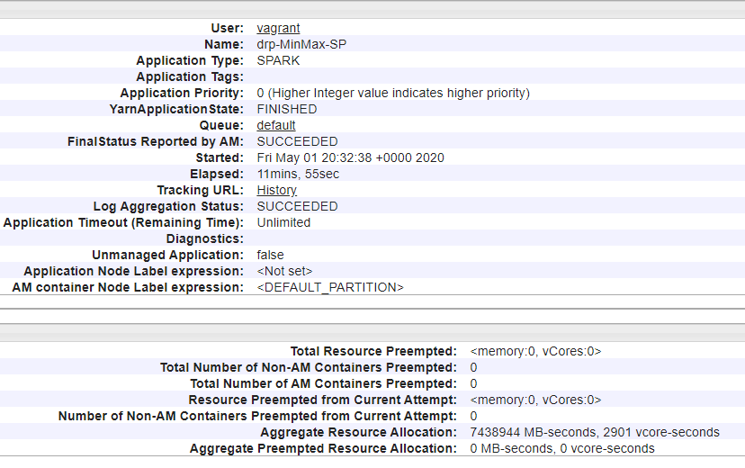
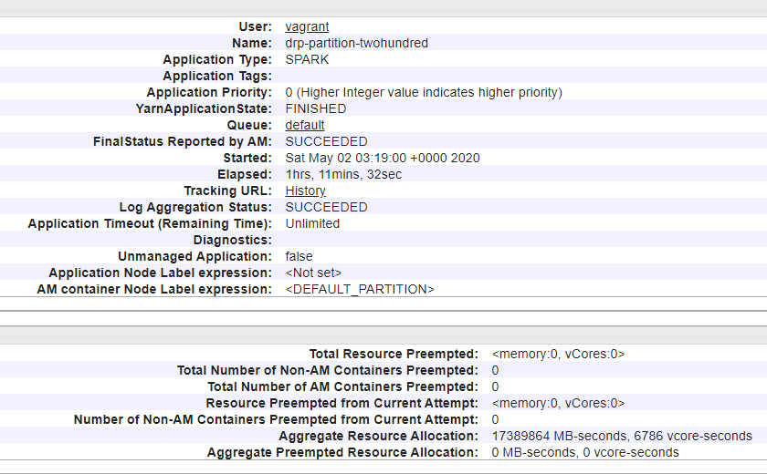

# ITMD-521 Cluster Analysis

## Phase 1

This phase makes use of the two single-year data files created in csv and parquet in the Read-Write assignment and uses variations in the code.

Please find the results in the path: ```hdfs://namenode/output/itmd-521/analysis/drp```

## Question 1 - Air Temperature and Atmospheric Pressure


* An additional Dataframe written to a file that has three columns: the total record count, the bad record count, and the percentage (bad/total)

<p align="center">
  
</p>

* An additional Dataframe written to a file that has three columns: the total record count, the bad record count, and the percentage (bad/total)

### * Please note that the spark-submit is still under execution. I had missed writing it into csv file. Below is the screenshot of the code  .show(). I will update the image with csv file output screenshot once the execution has completed.

<p align="center">
  
</p>


## Question 2 - Explain Partition Effect

* Briefly explain in a paragraph with references, what happens to execution time when you reduce the shuffle partitions from the default of 200 to 20?

## Ans
### Referring Chapter 02 and Chapter 10
The shuffle partitions parameter is used to control the physical execution characteristics of the Spark job. With different values of the shuffle partitions, we see different runtimes.By default, when we perform a shuffle, Spark outputs 200 partitions.Hence, this parameter helps in configuring the number of partitions to use when shuffling data for joins or aggregations


Codeline for setting the shuffle partitions to 20: ```spark.conf.set("spark.sql.shuffle.partitions",20)```


### Execution time for default value of shuffle partitions:
<p align="center">
  
</p>

### Execution time for shuffle partitions = 20:

<p align="center">
  
</p>

We can see that the execution time in both cases is approximately same. Ideally the execution time should be lower in the greater value of shuffle partitions due to increased parallelism but here, there is less difference due to the workload(pending executions) on the cluster.

* Retrieve the minimum and maximum AirTemperature for each of the 12 months for the decade.

## Ans

Below are the screenshots for the minimum and maximum AirTemperature for 2 months for the decade. Similarly, 12 files have been created for each month.

<p align="center">
  
</p>

<p align="center">
  
</p>

## Question 3

* Using the .partitionBy partition your year’s data by Month

### Referring Chapter 09
partitionBy is used to control the specific layout of the files at the destination.
Below is the screenshot taken of the number of files created. Total 12 files have been created for each month after using .partitionBy

<p align="center">
  
</p>

* lz4 compression

Using the code line : 
```df2.write.format("json").option("compression","lz4").save("hdfs://namenode/output/itmd-521/drp/2000/lz4/json/")```

Below is the screenshot of the list of the files created after lz4 compression:

 <p align="center">
  
</p>

Similarly lz4 compression has been performed for csv files.

## Question 4

* Show a screenshot of the execution times for your year
  * 1
 <p align="center">
  
</p>

  * 50
  <p align="center">
  
</p>

  * 200
 <p align="center">
  
</p>

* Show a screenshot of the execution times for your decade
  * 1
  <p align="center">
  
</p>

  * 50
 <p align="center">
  
</p>

  * 200
  <p align="center">
  
</p>

* Compare the execution times and explain why or why not there are any significant differences in the first group and in the second group

### Referring Chapter 13
.repartition is used to shuffle the data across the nodes and increase the level of parallelism thus ideally decreasing the runtime. But as we can see the execution status using all three partitions is approximately same or with very less difference, which could be due to the increase workload across the cluster.
